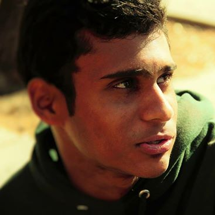

# Pramodya Rajapkse
Hi, my name is Pramodya Rajapakse (pronounced *pruh-moe-dee-ya*), although I also go by Prom (like the dance). I am a third-year transfer student majoring in Computer Science. 



## Me as a Programmer
I started programming in my senior year of high school, and although I wasn't entirely sure that I was going to pursue computer science as my major, it was really the only area that I was interested in. Although 4 years feels like a long time, I still like I've only scratched the surface of programming as a whole, but I am excited to keep learning and growing. My time in community college, although productive, felt somewhat scattered, so I'm eager to really start honing in a specific area of computer science.
Thus far my experience mainly includes:
- C++/C
- Java
- Python

As for the CSE courses I have taken so far at UCSD, I have completed CSE 21, 15L, 100 and 105, and this quarter I am taking CSE 110, 101 and 150B. [Here](https://github.com/pramodya-rajapakse/cse15l-lab-reports) is a link to my work for CSE-15L, and a short snippet of a shell script I wrote for one of the labs is:
```
git clone $1 $REPO_PATH
if [[ $? -ne 0 ]]
then
    echo "ERROR: Could not clone the student's repository"
    echo -e "\n==> Final Grade: 0/100"
    exit 1
fi
echo "--> Cloned student's repository"
```

Although I have done work in other languges (R, SQL), these three are the ones I am most comfortable with. However, I have started to realize that knowing a language is far less important than the underlying principles that you employ on a project. 
In terms of web development, I am very much out of practice. I dabbled in it for a short time after high school, but never had the time to commit to an extensive project. In terms of the languages used for web development, from most comfortable to least comfortable:
1. Javascript
2. HTML
3. CSS

### CSE-110
I was surprised that the required coursework for Software Engineering was only one class, so I'm sure I will not be industry-ready by the end of this class. However, I do hope this class will demystify the true work and skills that are required of a software engineer, and at least give a taste of what working on a long (relatively speaking) project with a group will be like. As such, my goals for this class are:
- [ ] Become comfortable with the fundamental tools needed for development projects (source control, CLI, project management)
- [ ] Get a sense of where I am lacking in terms of writing and maintaining quality code
- [ ] Get a sense of the challenges and pitfalls that come with coordinating with a group

## Me as a Person
I was born in Sri Lanka, but my family moved to the United States before I turned one year old, so I've been here basically my entire life. I enjoy reading, and I have been trying to hike and run more. 
[Here](/sd.jpg) is the image of myself above (as a relative link).

A quote I try to live by is
> Be tolerant with others and strict with yourself - Marcus Aurelius

